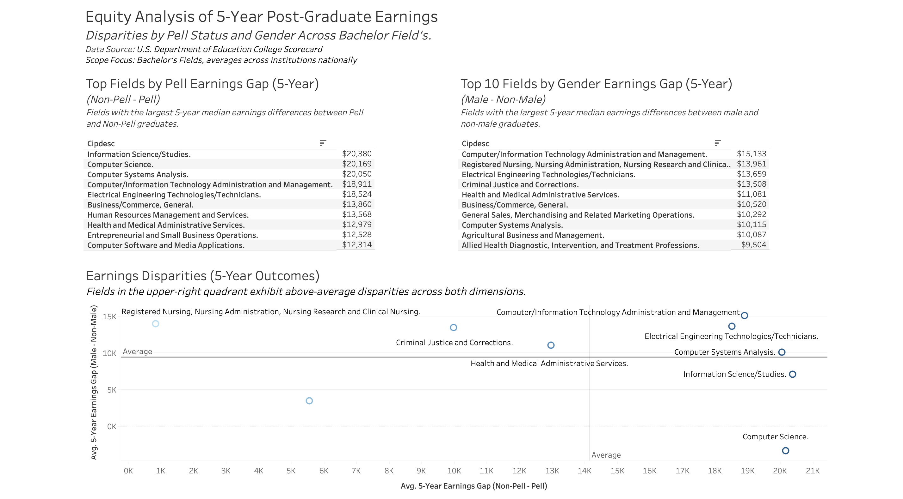

# Equity Analysis of 5-Year Post-Graduate Earnings

## Overview
This project analyzes 5-year post-graduate earnings disparities across bachelor’s degree fields using U.S. Department of Education College Scorecard data.

The analysis focuses on:
- Socioeconomic disparity (Non-Pell – Pell graduates)
- Gender disparity (Male – Non-Male graduates)
- Field-level differences in national earnings outcomes

## Data Source
U.S. Department of Education – College Scorecard  
Scope: Bachelor’s degree programs, aggregated across institutions

## Methods
- Filtered and cleaned 6,800+ program records using Python (pandas)
- Engineered earnings gap metrics:
  - `pell_gap` = Non-Pell – Pell 5-year median earnings
  - `gender_gap` = Male – Non-Male 5-year median earnings
- Aggregated disparities by field of study
- Developed an executive-style dashboard in Tableau to visualize disparities

## Key Findings
- Technical and business-oriented fields exhibit the largest observed socioeconomic earnings gaps.
- Gender disparities vary more widely across disciplines.
- Several fields demonstrate above-average disparities across both socioeconomic and gender dimensions.

## Dashboard Preview

## Tools Used
- Python (pandas)
- Tableau
- Git
